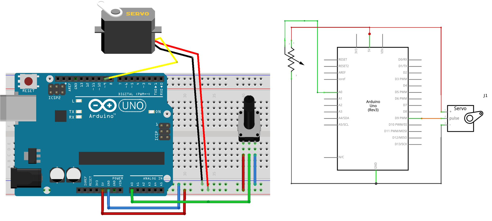

### :triangular_flag_on_post:  9. Servo Motor Control
Now, lets substitute our LED for a **Servo Motor**.   
    
Servos are motors with a shaft that can turn to a specified position. They usually have a range from 0 to 180 degrees. With an Arduino we can tell a servo to go to a specified position. We will see how to connect a servo motor and then how to turn it to different positions defined by the value of our potentiometer. 

#### Circuit
Our servo motor has a female connector with three pins. 
- The darkest, brown here, is usually the ground. Connect it to the Arduino GND.
- Connect the power cable that in all standards should be red to 5V on the Arduino.
- Connect the remaining line on the servo connector to a digital 9 (or 10) on the Arduino.    



*Note that servos can draw considerable power, so if you need to drive more than one or two, you'll probably need to power them from a separate supply (i.e. not the +5V pin on your Arduino).*


#### Code
In this example we will use **a specific servo library** that will make coding a lot easier.   

To use a library in a sketch, select it from Sketch > Import Library or just type in the `#include <name_of_library>` command.

```c++
#include <Servo.h>

Servo myservo;    // create servo object to control a servo

int potpin = A0;  // analog pin used to connect the potentiometer
int val;          // variable to read the value from the analog pin

void setup() {
  myservo.attach(9);  // attaches the servo on pin 9 to the servo object
}

void loop() {
  // read the value of the potentiometer
  val = analogRead(potpin);            
  // scale it to use it with the servo (value between 0 and 180)
  val = map(val, 0, 1023, 0, 180);
  // sets the servo position according to the scaled value     
  myservo.write(val);     
  // waits for the servo to get there             
  delay(15);                           
}
```
See [the servo reference page](https://www.arduino.cc/en/reference/servo) on how to use it.

The key functions used here are:
- Servo *objectname*;
- *objectname*.attach*(interface)* select the pin for servo. This can only use pin 9 or 10.
- *objectname*.write*(angle)* used to control the angle of the servo (0 to 180 degree).
